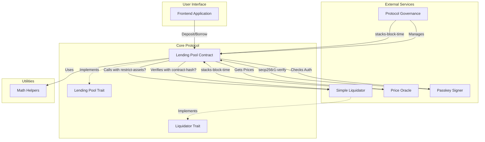
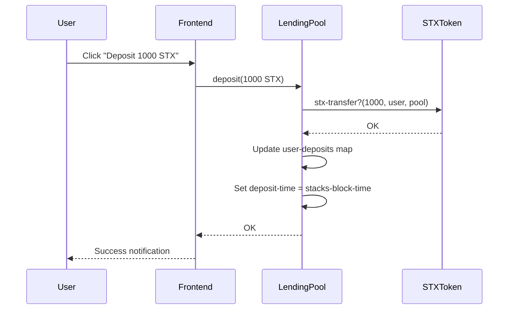
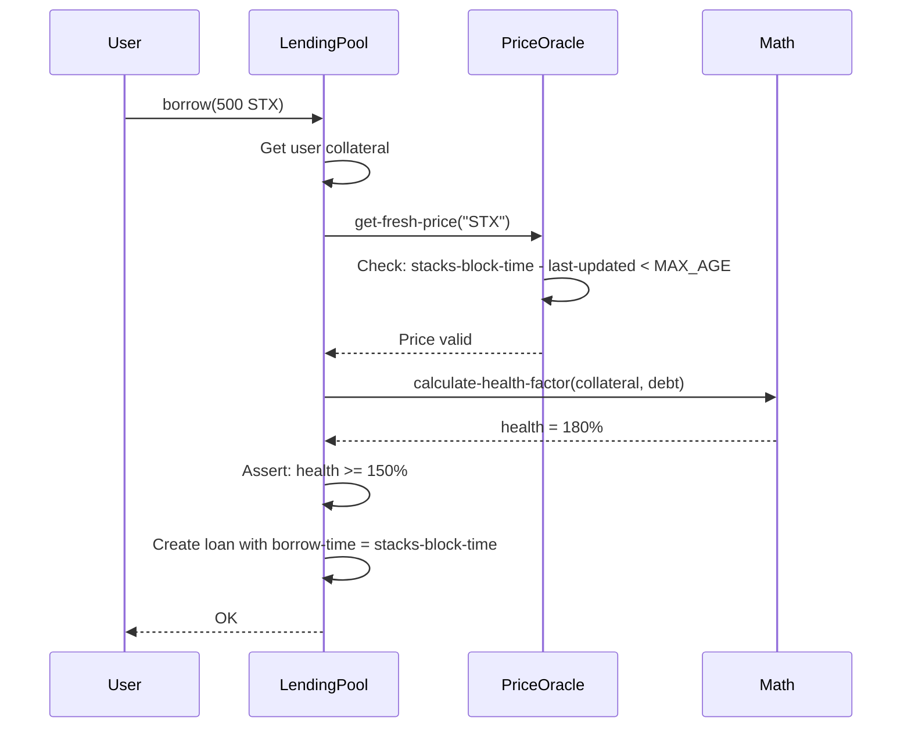
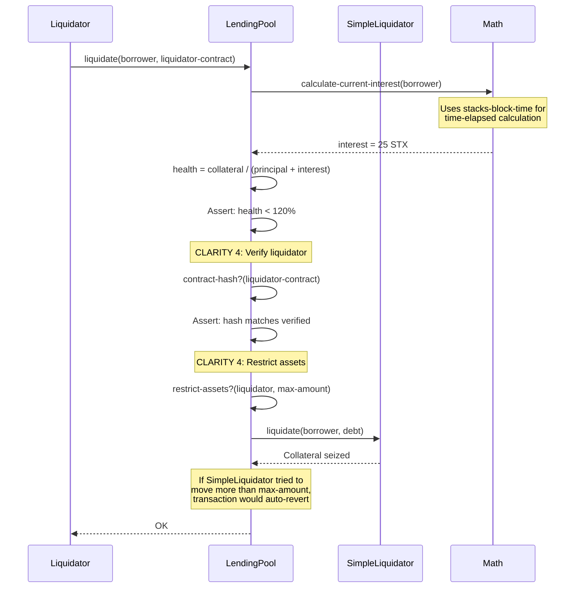

# Architecture Overview

## System Architecture

The Bitcoin-Native DeFi Lending Protocol is built as a modular, composable system leveraging Clarity 4's advanced features for security and functionality.



## Contract Relationships

### 1. Lending Pool (Core)
**File:** `contracts/lending-pool.clar`

**Responsibilities:**
- Accept deposits from users
- Issue collateralized loans
- Calculate interest using time-based logic
- Coordinate liquidations with verification
- Implement trait interface

**Clarity 4 Features Used:**
- `stacks-block-time` - Interest accrual, loan timestamps
- `contract-hash?` - Verify liquidator contracts
- `restrict-assets?` - Protect funds during liquidations
- `to-ascii?` - Generate readable loan status

**Key Functions:**
```clarity
deposit(amount) -> response
borrow(amount) -> response
liquidate(borrower, liquidator) -> response
calculate-current-interest(user) -> response
get-loan-status-ascii(user) -> response
```

### 2. Price Oracle
**File:** `contracts/oracle/price-oracle.clar`

**Responsibilities:**
- Store asset prices with timestamps
- Validate price freshness
- Provide human-readable status

**Clarity 4 Features Used:**
- `stacks-block-time` - Price update timestamps, staleness checks
- `to-ascii?` - Price status messages

**Data Flow:**
```
Admin -> update-price() -> Store price + timestamp
User -> get-fresh-price() -> Check age via stacks-block-time -> Return price or error
```

### 3. Passkey Signer
**File:** `contracts/auth/passkey-signer.clar`

**Responsibilities:**
- Register secp256r1 public keys (passkeys)
- Verify WebAuthn/FIDO2 signatures
- Support multi-signature scenarios

**Clarity 4 Features Used:**
- `secp256r1-verify` - Passkey signature verification
- `to-ascii?` - Authentication summaries

**Authentication Flow:**
```
1. User registers passkey -> Public key stored on-chain
2. User initiates sensitive action -> Frontend generates signature
3. Contract verifies signature -> secp256r1-verify(hash, sig, pubkey)
4. If valid -> Action proceeds
```

### 4. Protocol Governance
**File:** `contracts/governance/protocol-governance.clar`

**Responsibilities:**
- Create and manage proposals
- Implement voting mechanism
- Enforce timelocks on execution
- Verify contract upgrades

**Clarity 4 Features Used:**
- `stacks-block-time` - Timelock enforcement
- `contract-hash?` - Verify new contracts before upgrade
- `to-ascii?` - Proposal status reports

**Governance Flow:**
```
Create Proposal -> Voting Period (1 week) -> Timelock (24 hours) -> Execute
                                              ↓
                                     Uses stacks-block-time
                                     to enforce delay
```

### 5. Liquidator System
**File:** `contracts/liquidators/simple-liquidator.clar`

**Responsibilities:**
- Implement liquidator trait
- Execute liquidations safely
- Work within asset restrictions

**Security Model:**
```
Lending Pool wants to liquidate:
1. contract-hash?(liquidator) -> Verify it's approved code
2. restrict-assets?(liquidator, limits) -> Set hard limits
3. Call liquidator.liquidate() -> Execute
4. If liquidator tries to exceed limits -> Transaction reverts
```

## Data Flow Diagrams

### Deposit Flow


### Borrow Flow with Health Check


### Liquidation Flow (Clarity 4 Security)


## Storage Layout

### Lending Pool Maps
```clarity
user-deposits: { user: principal } -> { amount: uint, deposit-time: uint }
user-collateral: { user: principal } -> { amount: uint, asset: string }
user-loans: { user: principal } -> { 
    principal-amount: uint,
    interest-accrued: uint,
    borrow-time: uint,
    last-interest-update: uint  // Uses stacks-block-time
}
```

### Price Oracle Maps
```clarity
prices: { asset: string } -> {
    price: uint,
    last-updated: uint,  // stacks-block-time
    source: string
}
```

### Passkey Signer Maps
```clarity
user-passkeys: { user: principal } -> {
    public-key: buff 33,  // secp256r1
    registered-at: uint,
    device-name: string
}
```

## Security Mechanisms

### 1. Contract Verification (contract-hash?)
- Admins register liquidators by storing their code hash
- Before liquidation, pool verifies hash matches
- Prevents malicious contract substitution

### 2. Asset Restrictions (restrict-assets?)
- Pool sets exact limits on asset movement
- Liquidator cannot exceed limits
- Automatic rollback on violation

### 3. Time-Based Security (stacks-block-time)
- Governance has 24-hour timelock
- Prices have 1-hour freshness requirement
- Interest calculated precisely by time elapsed

### 4. Passkey Authentication (secp256r1-verify)
- Users can require passkey for withdrawals
- Hardware wallet signatures verified on-chain
- Multi-device support

## Performance Considerations

### Clarity 4 SIP-034 Benefits
- **Dimension-specific tenure extensions** allow:
  - High read operations without blocking writes
  - Complex calculations without timeout
  - Better throughput for DeFi operations

### Gas Optimization
- Interest calculation is read-only (no state changes)
- Health factor checks use efficient math
- Trait-based design enables modularity

## Upgrade Path

### Using Governance
```
1. Create upgrade proposal -> Includes new contract address
2. contract-hash?(new-contract) -> Store hash in proposal
3. Community votes
4. After timelock expires (stacks-block-time check)
5. Execute: Verify hash still matches
6. If hash changed -> Reject upgrade
7. If hash matches -> Approve upgrade
```

## Frontend Integration

### Key Integration Points
1. **Wallet Connection** - Hiro Wallet, Leather Wallet
2. **Contract Calls** - @stacks/transactions
3. **Real-time Updates** - Poll contract state every 10s
4. **Passkey Support** - WebAuthn API integration

### State Management
```javascript
// Frontend tracks:
- User deposits
- User loans
- Health factor (calculated client-side + verified on-chain)
- Interest accrual (updates every block)
```

## Testing Strategy

### Unit Tests
- Each contract function tested independently
- Edge cases covered (zero amounts, max values)
- Error conditions verified

### Integration Tests
- Full deposit -> borrow -> repay flow
- Liquidation with verified liquidators
- Governance proposal lifecycle

### Clarity 4 Feature Tests
- `stacks-block-time` - Advance time, check interest
- `contract-hash?` - Modify contract, verify hash changes
- `restrict-assets?` - Attempt over-withdrawal, expect revert
- `to-ascii?` - Verify output formatting
- `secp256r1-verify` - Test with valid/invalid signatures

## Deployment Checklist

1. ✅ Deploy math-helpers
2. ✅ Deploy traits
3. ✅ Deploy price-oracle
4. ✅ Deploy passkey-signer
5. ✅ Deploy lending-pool
6. ✅ Deploy simple-liquidator
7. ✅ Deploy protocol-governance
8. ✅ Register liquidator with lending-pool
9. ✅ Set initial prices in oracle
10. ✅ Test all integrations

---

This architecture demonstrates production-ready patterns for building secure, sophisticated DeFi applications on Bitcoin using Clarity 4.
